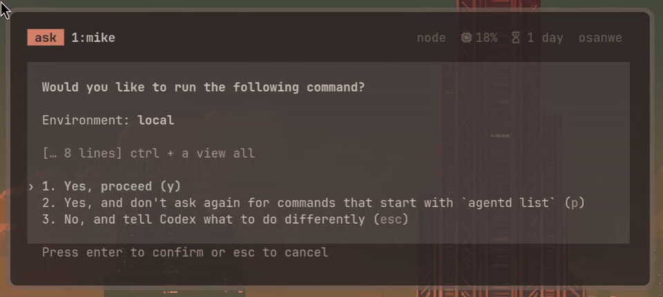

<div align="center">

# Yoohoo! ✨

### Darling, your window would like a word.

**Know which windows need you. Get to them when you're ready.**

A breathing border, a soft pop, and a bell menu for Omarchy.



[](https://github.com/clickety-clacks/yoohoo/actions/workflows/tests.yml)
[](LICENSE)

</div>

---

When a window needs you, Yoohoo gives it a gently breathing border, a soft
sound, and a spot in your bar's bell menu. Pick it from the menu when you're
ready. Its entry clears and its border goes back to normal. Switching to it
yourself or closing it clears the entry too. Until then, it waits.

## Agents, meet your stage manager

Running **Codex CLI or Claude Code** in several terminals? Let them work while
you do something else. When an agent asks for you through a supported terminal's
bell or desktop notification, Yoohoo marks that window and adds it to the menu.
You can see who's waiting without checking every terminal. Very considerate
of them, for once.

We recommend **Ghostty**, the terminal used for Yoohoo's live checks. Other
terminals can work if they emit supported attention signals. The agent and
terminal must actually send a bell or notification; Yoohoo doesn't read the
conversation to work out when a task is done. No agent-specific hooks are needed.

Want your own **Quickshell** UI? Use Yoohoo's attention list to build a panel
of waiting agent windows or add attention badges to your workspace overview.
Read `window-attention list` for structured JSON and call
`window-attention focus ADDRESS` when someone picks a window. Yoohoo keeps
the list up to date; your UI decides how to show it.

**Ready?** Start with [requirements](#requirements) and
[installation](#installation). [Settings](#the-dressing-room),
[verification](#receipts-please), and [uninstallation](#take-a-bow) are below too.

## She's got range

- **A tasteful pulse.** A 5px border breathes between your theme's inactive
  and active border colors. No hardcoded pink. Fabulous is theme-independent.
- **A little pop.** One soft sound when a window first joins the list, with a
  shared cooldown. Repeat requests stay quiet.
- **A guest list.** A bell-menu entry shows the window, workspace, age, and
  signal count. Select it to go there.
- **An exit cue.** Focusing or closing the window clears its entry and
  attention styling.
- **Receipts.** A local JSON list for other UIs, plus optional JSONL history.
- **Manners.** Yoohoo waits for you to pick a window before taking you there.
  See [how it works](#how-she-knows) for the detection rules and limits.

## Requirements

Yoohoo is an **early per-user integration for Lua-based Omarchy**. It has been
tested on Hyprland **0.56.2** with Omarchy's Quickshell shell. Other versions
need validation; the installer does not support older `.conf`-based Hyprland
setups. This is an independent project, not an official Omarchy component.

Required: Python **3.11+**, Hyprland's `hyprctl`, Omarchy/Quickshell, a systemd
user session, and PipeWire's `pw-play`. Standard desktop-notification capture
also needs `python-dbus` and `python-gobject` and a session bus that allows
`BecomeMonitor`. Everything runs locally. Coding agents, Ghostty, and tmux
are not required dependencies.

On an otherwise supported Omarchy install, install any missing Python bindings:

```bash
omarchy pkg add python-dbus python-gobject
```

## Installation

For a versioned installation, download the archive and `SHA256SUMS` from the
[latest release](https://github.com/clickety-clacks/yoohoo/releases/latest),
then follow that release's checksum, extraction, and install instructions.
Each archive includes the installer and default sound. No Git checkout required.

Or install the development version from the repository. Run as your desktop
user, **not root**:

```bash
git clone https://github.com/clickety-clacks/yoohoo.git
cd yoohoo
python install.py install
```

The installer checks prerequisites, copies the package, preserves existing
personal settings, adds a Hyprland include and bar entry if absent, enables
the user service, and reloads the desktop integration. It does not install
packages or replace your desktop configuration with somebody else's dotfiles.
Changed existing files are backed up under `~/.local/state/yoohoo/backups/`.
There is no automatic rollback. If activation fails, inspect the reported
error; the backups contain the files from before installation.

To update a Git checkout, run `git pull --ff-only`, then the install command
again. Restarting the service clears pending attention; history stays. The
installer also restarts the shell because hot-reloading the plugin has
previously left duplicate menu handlers running.

**Chezmoi users:** these are ordinary user files at stable paths. Chezmoi can
continue tracking them. After an update, inspect `chezmoi diff` and capture
the intended changes; otherwise a later apply may restore older versions.

## The dressing room

### Keyboard menu controls

Yoohoo provides generic actions; it does not install any global shortcuts.
Call them through `qs ipc -p /usr/share/omarchy/shell call window-attention.indicator ACTION`:

| Action | Behavior |
| --- | --- |
| `next` | Open with the first entry selected, or cycle forward if already open. |
| `previous` | Open with the last entry selected, or cycle backward if already open. |
| `accept` | Open the selected window only during a session started by next/previous. |
| `cancel` | Close without opening a window. |
| `toggle` | Ordinary menu open/close; no release-to-accept session. |

Inside the menu, Tab/Shift+Tab and arrow keys cycle, Enter opens, and Escape
cancels. Selection wraps, follows the same window across refreshes, and scrolls
into view. Clicking the bell still opens an ordinary menu.

For an optional Super+Tab switcher, add this to your personal Hyprland Lua
bindings. **This replaces Omarchy's next/previous workspace shortcuts.** Choose
different keys if you use those shortcuts. The modifier is your choice, not a
Yoohoo requirement.

```lua
hl.unbind("SUPER + TAB")
hl.unbind("SUPER + SHIFT + TAB")
local yoohoo_ipc = "qs ipc -p /usr/share/omarchy/shell call window-attention.indicator ordered "
local yoohoo_epoch = tostring(os.time()) .. "-" .. tostring(math.random(1000000))
local yoohoo_session, yoohoo_sequence = 0, 0
local function yoohoo_send(action)
  if action == "accept" and yoohoo_sequence == 0 then return end
  if yoohoo_sequence == 0 then yoohoo_session = yoohoo_session + 1 end
  yoohoo_sequence = yoohoo_sequence + 1
  hl.exec_cmd(yoohoo_ipc .. action .. " " .. yoohoo_epoch .. "-" .. yoohoo_session .. " " .. yoohoo_sequence)
  if action == "accept" then yoohoo_sequence = 0 end
end
o.bind("SUPER + TAB", "Yoohoo: open or next", function() yoohoo_send("next") end)
o.bind("SUPER + SHIFT + TAB", "Yoohoo: open or previous", function() yoohoo_send("previous") end)
o.bind("Super_L", nil, function() yoohoo_send("accept") end, { release = true, ignore_mods = true, non_consuming = true, transparent = true })
o.bind("Super_R", nil, function() yoohoo_send("accept") end, { release = true, ignore_mods = true, non_consuming = true, transparent = true })
```

Hold Super and tap Tab to cycle; add Shift to reverse; release Super to open
your selection. Escape cancels, and releasing Super after cancellation does
nothing. `transparent` keeps the release binding from being suppressed after
Tab; `ignore_mods` lets it work even if Shift is still held. No shortcuts are
changed by installation or upgrade.

The example uses `ordered ACTION STREAM SEQUENCE`, an optional IPC transport
for bindings that spawn separate processes. Give each held-key session a unique
stream ID and number its commands from 1. Yoohoo buffers out-of-order arrivals
and ignores duplicates, so a quick release cannot reach the menu before its
opening command. Plain `next`, `previous`, `accept`, and `cancel` remain available
for callers that already deliver commands in order. Losing a command or restarting
the shell mid-session can abandon that session; release and press again to start
a new one. The menu itself contains no modifier-key policy.

### Files and settings

Stage name Yoohoo, filename `window-attention`. The files keep the original
name so existing installs and dotfile tracking keep working.

| Location | What lives there |
| --- | --- |
| `~/.local/bin/window-attention` | Daemon and CLI |
| `~/.config/window-attention/config.toml` | Your settings |
| `~/.config/hypr/attention.lua` | Focus policy and theme-aware rules |
| `~/.config/omarchy/plugins/window-attention.indicator/` | Yoohoo bell menu |
| `~/.config/systemd/user/window-attention.service` | Session service |
| `~/.local/share/sounds/window-attention/soft-ui-pop.mp3` | Default sound |
| `~/.local/share/window-attention/` | Docs, licenses, tests, diagnostic utility |
| `~/.local/state/window-attention/` | Current list and history |
| `~/.local/state/yoohoo/` | Installer record and backups |

The installer currently targets standard home-directory paths. Custom XDG
directory layouts are not yet supported. It appends `require("hypr.attention")`
to `~/.config/hypr/hyprland.lua` and adds `window-attention.indicator` to the
existing bar layout without duplicating it.

Set the mood in `~/.config/window-attention/config.toml`:

```toml
sound_enabled = true
sound_path = "~/.local/share/sounds/window-attention/soft-ui-pop.mp3"
sound_volume = 0.35
sound_cooldown_ms = 1500
history_enabled = true
desktop_notifications_enabled = true
```

Restart `window-attention.service` after changing daemon settings. Disable
sound if you prefer a silent entrance. Disabling desktop-notification capture
leaves native urgency active.

For rendering changes, edit `attention.lua`, run `hyprctl reload`, and check
`hyprctl configerrors`. The border breathes over a 3.6-second cycle: a
1.6-second rise, a 1.6-second fall, and a 0.4-second rest. Hyprland renders an
ease-in-out-sine approximation using a cubic Bezier with control points
`(0.37, 0)` and `(0.63, 1)`. Its shared `border` animation leaf also softens
ordinary focus-border color changes. This setting applies to all window borders.

The shape is inspired by Apple's [breathing status LED patent](https://patents.google.com/patent/US6658577B2/en):
a biased sinusoidal brightness envelope with a quiet interval. The patent's
example uses a 1.8-second overall period and a 0.4-second quiet interval;
Yoohoo deliberately uses a slower cycle, adapted to theme colors rather than
LED brightness. It approximates the patent's curve; actual Mac firmware may
use different timing or curves. The corresponding normalized fade is
`f(u) = (1 - cos(pi * u)) / 2` for `u` from 0 to 1.

## How she knows

Two existing desktop signals, one attention list:

1. **Native urgency:** Hyprland emits `urgent` with an exact window identity.
   `misc.focus_on_activate = false` prevents ordinary activation requests
   from moving focus. Yoohoo records and tags the window instead.
2. **Standard desktop notifications:** a passive D-Bus monitor observes
   `org.freedesktop.Notifications.Notify`, obtains the sender PID from bus
   credentials, and accepts it **only if it owns exactly one Hyprland window**.

The daemon owns tags and state. Hyprland owns rendering. The shell plugin
reads the list. Only an explicit menu selection requests focus.

### Even a diva has boundaries

- Some notification senders can't be matched to a window: `notify-send` and
  similar helpers, proxies, disconnected senders, and processes that own
  several windows. Yoohoo skips those notifications. Native urgency still
  works if the application emits it.
- A finished job that emits neither signal cannot be detected. Yoohoo does
  not watch agent lifecycles or infer completion from terminal text.
- If an app emits both inputs, the count may increase twice. It counts
  **signals**, not tasks; repeated signals do not replay the sound.
- Hyprland's foreign-toplevel activation can bypass its ordinary activation
  policy (window switchers need this). Yoohoo never invokes it automatically,
  but cannot stop other tools from doing so.
- Already-focused windows are ignored. Orderly service stops clear pending
  entries. Crash recovery requires matching addresses and stable window IDs.
- Notification payload text is not stored, but history includes **window
  titles**, which can be sensitive. History is local, unbounded, and has no
  automatic rotation yet. Disable it or manage retention yourself.
- Theme colors that are identical will not produce a visible color pulse;
  disabled border animations make the transitions discrete.

## Receipts, please

```bash
window-attention list
window-attention play-sound
systemctl --user status window-attention
journalctl --user -u window-attention
python -B -m unittest discover -s tests -v
```

`~/.local/state/window-attention/current.json` has a versioned `windows` list.
Each entry contains an address, stable ID, title, class, workspace,
timestamps, signal count, and source. Events append to `history.jsonl` when
enabled. Custom UIs can read the list without scraping notifications.

The installed regression suite can also run with:

```bash
python -B ~/.local/share/window-attention/test_attention.py
```

Automated tests cover daemon state/race handling and staged installation,
JavaScript selection policy (the full development suite also requires Node.js),
reinstallation, config preservation, and removal. Desktop behavior and
compatibility with other Omarchy versions require live testing. Live checks
on the original deployment exercised both native urgency and real terminal
desktop notifications, unchanged focus, sound playback, interpolated border
pixels, menu selection, acknowledgement, and shutdown cleanup.

For a native terminal check, arrange a delayed BEL in a terminal that supports
compositor attention, switch away before it fires, then acknowledge it through
the bell menu. A passive diagnostic is included at
`~/.local/share/window-attention/notification_probe.py`; it logs sender identity,
not notification content. Neither the diagnostic nor Yoohoo invokes a
notification action to discover its target window.

## Take a bow

```bash
python install.py uninstall
```

Stops/disables the service, removes attention integrations and unchanged
package files, and retains personal settings, event history, backups, and
modified files. Uninstallation requires its install record. Empty parent
directories may remain. Chezmoi users, update your tracked state too, or a
later restore will bring Yoohoo right back.

For file-only staging or testing, use `--home /path/to/staged-home --no-activate`.
That home must contain a supported `hyprland.lua` and `shell.json`; no real
desktop commands run in this mode.

## Credits & couture

Code: [MIT](LICENSE). The soft UI pop is by **humordome**, Pixabay asset
**451232**, used as Yoohoo's notification cue under the separate Pixabay
Content License. See [third-party terms](THIRD_PARTY.md); the sound is **not**
MIT licensed and must not be redistributed as a standalone audio asset.

Made by [clickety-clacks](https://github.com/clickety-clacks).
Independent of the Omarchy project.

Maintainers: [how to cut a release](RELEASING.md).

**They can wait, darling.** 💅
